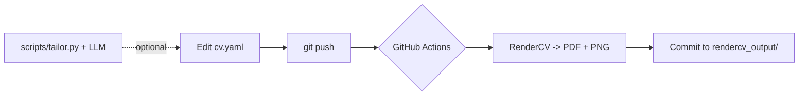

# ai-resume-generator

> An open-source resume pipeline: a single YAML source of truth → an ATS-friendly PDF,
> rendered automatically by GitHub Actions (RenderCV + LaTeX), with an **optional AI step**
> that tailors your bullets to a target job description.


## How it works



## Features
- YAML-based, version-controlled resume (single source of truth)
- Automatic PDF generation via CI/CD (no local LaTeX needed)
- ATS-friendly, clean LaTeX output
- **Optional AI tailoring** to a job description (local, opt-in)
- Easy theming (colors, fonts, margins)

## Tech Stack
YAML · RenderCV · GitHub Actions · LaTeX · Python · (optional) LLM API (OpenAI / Anthropic / Gemini / Ollama)

## Project Structure
```
cv.yaml                 # your resume data + design (demo data included)
scripts/tailor.py       # optional AI tailoring step
rendercv_output/        # generated PDF + preview.png (committed)
.github/workflows/      # CI that renders on every push
```

## Quick start (use it as your own)
1. Fork / clone the repo.
2. Edit `cv.yaml` (the included data is **example/demo** — replace it with yours).
3. `pip install "rendercv[full]==2.8"` then `rendercv render cv.yaml`.
4. Push — GitHub Actions regenerates the PDF + preview automatically.

## How the AI works

The AI step is an **optional, local helper** (`scripts/tailor.py`) that rewrites your
resume's bullet points to better match a specific job description. It reads your
`cv.yaml` and a job-ad text file, sends both to an LLM with the instruction
*"rewrite these bullets to fit this job, but never invent facts,"* and writes a
new `cv.tailored.yaml` for you to review. Your main `cv.yaml` is never changed.

```
cv.yaml + job_ad.txt  ──►  tailor.py  ──►  LLM API  ──►  cv.tailored.yaml  ──►  PDF
```

It is **not** part of the automatic GitHub Actions render — you run it on your own
computer only when you want to tailor a resume for a particular application. The AI
only rewords existing experience; it cannot add skills you don't have, so always
review the output before sending it anywhere.

### Supported providers

Set `AI_PROVIDER` to choose a model. Install the matching SDK and set its API key:

| Provider | `AI_PROVIDER` | Install | API key | Default model |
| --- | --- | --- | --- | --- |
| OpenAI | `openai` | `pip install openai` | `OPENAI_API_KEY` | `gpt-4o-mini` |
| Anthropic (Claude) | `anthropic` | `pip install anthropic` | `ANTHROPIC_API_KEY` | `claude-3-5-sonnet-latest` |
| Google Gemini | `gemini` | `pip install google-generativeai` | `GEMINI_API_KEY` | `gemini-1.5-flash` |
| Any OpenAI-compatible (Ollama, Groq, Together, DeepSeek, …) | `openai` + `OPENAI_BASE_URL` | `pip install openai` | `OPENAI_API_KEY` | `gpt-4o-mini` |

Override the model with `<PROVIDER>_MODEL` (e.g. `OPENAI_MODEL=gpt-4o`,
`ANTHROPIC_MODEL=claude-3-5-haiku-latest`).

### Example — OpenAI
```bash
pip install -r requirements.txt
export OPENAI_API_KEY=sk-...        # Windows: set OPENAI_API_KEY=sk-...
python scripts/tailor.py --cv cv.yaml --jd job_description.example.txt --out cv.tailored.yaml
rendercv render cv.tailored.yaml    # review the tailored PDF
```

### Example — Anthropic (Claude)
```bash
pip install anthropic
export ANTHROPIC_API_KEY=sk-ant-...
python scripts/tailor.py --cv cv.yaml --jd job_description.example.txt --provider anthropic --out cv.tailored.yaml
```

### Example — Google Gemini
```bash
pip install google-generativeai
export GEMINI_API_KEY=...
python scripts/tailor.py --cv cv.yaml --jd job_description.example.txt --provider gemini --out cv.tailored.yaml
```

### Example — local Ollama (no API key, runs on your machine)
```bash
ollama pull llama3.1
export OPENAI_BASE_URL=http://localhost:11434/v1
export OPENAI_API_KEY=ollama        # ignored locally, but the SDK requires a value
python scripts/tailor.py --cv cv.yaml --jd job_description.example.txt --out cv.tailored.yaml
```

## License
MIT — see [LICENSE](LICENSE).
