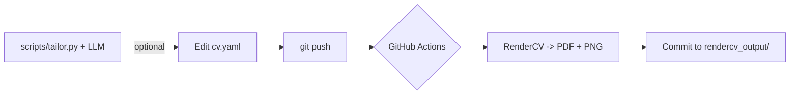

 ai-resume

> An open-source resume pipeline: a single YAML source of truth → an ATS-friendly PDF,
> rendered automatically by GitHub Actions (RenderCV + LaTeX), with an **optional AI step**
> that tailors your bullets to a target job description.


## How it works



## Features
- YAML-based, version-controlled resume (single source of truth)
- Automatic PDF generation via CI/CD (no local LaTeX needed)
- ATS-friendly, clean LaTeX output
- **Optional AI tailoring** to a job description (local, opt-in)
- Easy theming (colors, fonts, margins)

## Tech Stack
YAML · RenderCV · GitHub Actions · LaTeX · Python · (optional) OpenAI API

## Project Structure
```
cv.yaml                 # your resume data + design (demo data included)
scripts/tailor.py       # optional AI tailoring step
rendercv_output/        # generated PDF + preview.png (committed)
.github/workflows/      # CI that renders on every push
```

## Quick start (use it as your own)
1. Fork / clone the repo.
2. Edit `cv.yaml` (the included data is **example/demo** — replace it with yours).
3. `pip install "rendercv[full]==2.8"` then `rendercv render cv.yaml`.
4. Push — GitHub Actions regenerates the PDF + preview automatically.

## AI tailoring (optional)
```bash
pip install -r requirements.txt
export OPENAI_API_KEY=sk-...
python scripts/tailor.py --cv cv.yaml --jd job_description.example.txt --out cv.tailored.yaml
rendercv render cv.tailored.yaml   # review before using!
```
The AI only rewrites wording to match a role — it never invents facts. Always review.

## License
MIT — see [LICENSE](LICENSE).
