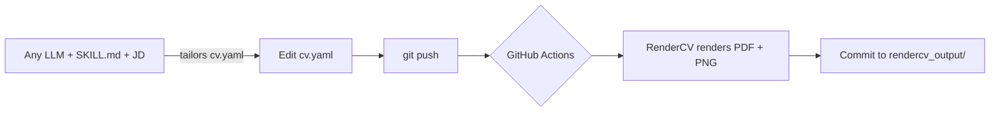

# ai-resume-generator
 
> An open-source resume pipeline: a single YAML source of truth → an ATS-friendly PDF,
> rendered automatically by GitHub Actions (RenderCV + LaTeX). CV content is tailored to a
> job description with any LLM using a reusable prompt (see `SKILL.md`).
 
Built while applying to 40+ working student and internship roles at once — see
[CONTRIBUTING.md](CONTRIBUTING.md#why-i-built-this) for the full story, and
[EXAMPLE.md](EXAMPLE.md) for a before/after of the AI tailoring in action.
 


 

 
## How it works
 

 
## Features
- YAML-based, version-controlled resume (single source of truth)
- Automatic PDF generation via CI/CD (no local LaTeX needed)
- ATS-friendly, clean LaTeX output
- **AI-assisted tailoring** with any LLM (ChatGPT / Claude / Gemini) using a reusable prompt — no API key, no cost
- Easy theming (colors, fonts, margins)
## Tech Stack
YAML · RenderCV · GitHub Actions · LaTeX · (optional) any LLM for tailoring
 
## Project Structure
```
cv.yaml                 # your resume data + design
SKILL.md                # reusable LLM prompt for tailoring + cover letter
rendercv_output/        # generated PDF + preview.png (committed)
.github/workflows/      # CI that renders on every push
```
 
## Quick start (use it as your own)
1. Fork / clone the repo.
2. Edit `cv.yaml` (replace the example data with yours).
3. `pip install "rendercv[full]==2.8"` then `rendercv render cv.yaml` (or just push — CI does it).
4. Push → GitHub Actions regenerates the PDF + preview automatically.
## AI tailoring (optional, free)
You don't need an API key. Use any chat LLM with the prompt in [`SKILL.md`](SKILL.md):
 
1. Open your LLM and paste the contents of `SKILL.md` as the instructions.
2. Send your `cv.yaml` + the job description you're applying for (see "HOW TO USE THIS SKILL" in `SKILL.md`).
3. The LLM returns a tailored `cv:` block, a cover letter, and a changes table.
4. Paste the `cv:` block back into `cv.yaml` (keep `design:`, `locale:`, `settings:` untouched).
5. Commit → the pipeline renders your tailored PDF.
The AI only rewords existing experience; it never invents facts. Always review before applying.
 
## License
MIT — see [LICENSE](LICENSE).```
